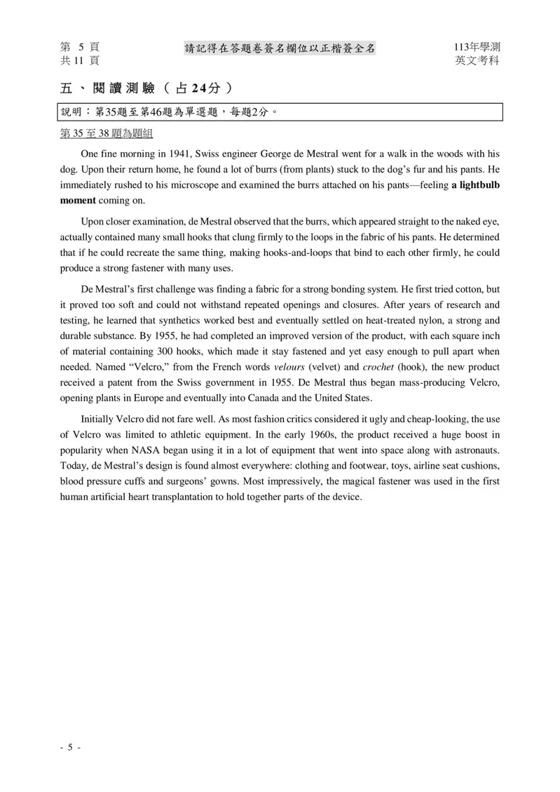
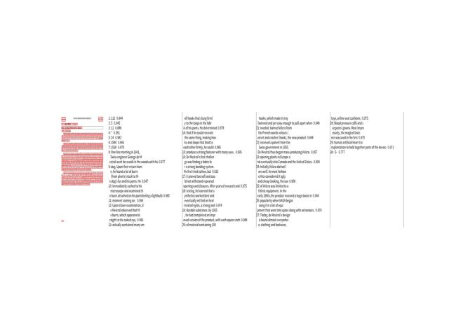

# 文字識別及翻譯

這個專案使用 PaddleOCR 進行圖像中的文字識別，並使用 Google Translate 進行翻譯。此程式能夠讀取影像檔，識別圖像中的文字，並將識別出的文字翻譯成指定的語言。

## 環境要求

- Python 3.6+
- PaddleOCR
- OpenCV
- PIL
- Matplotlib
- Googletrans

## 安裝

首先，確保您已經安裝了 Python 3.6 或更高版本。然後，您可以使用以下命令安裝所需的依賴：

```bash
pip install -r requirements.txt
```

## 執行
若要使用GPU來執行，請將 --gpu False 改為 True

```bash
python ppocr.py --image_path "path/to/your/image.jpg" --result_text_path "path/to/save/text.txt" --pic_lang "en" --target_lang "zh-cn" --gpu False
```
### paddleocr 語言種類代碼

| 語種 | 描述 | 縮寫 | 語種 | 描述 | 縮寫 |
|------|------|------|------|------|------|
| 中文 | chinese and english | ch | 保加利亞文 | Bulgarian | bg |
| 英文 | english | en | 烏克蘭文 | Ukranian | uk |
| 法文 | french | fr | 白俄羅斯文 | Belarusian | be |
| 德文 | german | de | 泰盧固文 | Telugu | te |
| 日文 | japan | ja | 阿巴紮文 | Abaza | abq |
| 韓文 | korean | ko | 泰米爾文 | Tamil | ta |
| 中文繁體 | chinese traditional | zh-TW | 南非荷蘭文 | Afrikaans | af |
| 義大利文 | Italian | it | 亞塞拜然文 | Azerbaijani | az |
| 西班牙文 | Spanish | es | 波士尼亞文 | Bosnian | bs |
| 葡萄牙文 | Portuguese | pt | 捷克文 | Czech | cs |
| 俄羅斯文 | Russia | ru | 威爾士文 | Welsh | cy |
| 阿拉伯文 | Arabic | ar | 丹麥文 | Danish | da |

### Google Translate 語言種類代碼
可以參考 [官網](<https://support.google.com/googleplay/android-developer/table/4419860?hl=zh-Hant> "Title") 知道更多語言代碼。
| 語言 | 代碼 | 語言 | 代碼 | 語言 | 代碼 |
|------|------|------|------|------|------|
| 南非荷蘭語 | af | 阿爾巴尼亞語 | sq | 阿姆哈拉語 | am |
| 阿拉伯語 | ar | 亞美尼亞語 | hy | 亞塞拜然語 | az |
| 巴斯克語 | eu | 白俄羅斯語 | be | 孟加拉語 | bn |
| 波士尼亞語 | bs | 保加利亞語 | bg | 加泰羅尼亞語 | ca |
| 宿務語 | ceb(ISO-639-2) | 中文（簡體） | zh-CN或zh(BCP-47) | 中文（繁體） | zh-TW(BCP-47) |
| 科西嘉語 | co | 克羅埃西亞語 | hr | 捷克語 | cs |
| 丹麥語 | da | 荷蘭語 | nl | 英語 | en |
| 世界語 | eo | 愛沙尼亞語 | et | 芬蘭語 | fi |
| 法語 | fr | 弗裡斯蘭語 | fy | 加利西亞語 | gl |
| 格魯吉亞語 | ka | 德語 | de | 希臘語 | el |

## 結果

### 原圖

### 識別結果


113 5 11 * 24 3546 3538 One fine morning in 1941, Swiss engineer George de Mestral went for a walk in the woods with his dog. Upon their return home, he found a lot of burrs (from plants) stuck to the dog's fur and his pants. He immediately rushed to his microscope and examined the burrs attached on his pantsfeeling a lightbulb moment coming on. Upon closer examination, de Mestral observed that the burrs, which appeared straight to the naked eye, actually contained many small hooks that clung firmly to the loops in the fabric of his pants. 
He determined that if he could recreate the same thing, making hooks-and-loops that bind to each other firmly, he could produce a strong fastener with many uses. De Mestral's first challenge was finding a fabric for a strong bonding system. He first tried cotton, but it proved too soft and could not withstand repeated openings and closures. After years of research and testing, he learned that synthetics worked best and eventually settled on heat-treated nylon, a strong and durable substance. By 1955, he had completed an improved version of 
the product, with each square inch of material containing 300 hooks, which made it stay fastened and yet easy enough to pull apart when needed. Named Velcro from the French words velours (velvet and crocher (hook), the new product received a patent from the Swiss government in 1955. De Mestral thus began mass-producing Velcro. opening plants in Europe and eventually into Canada and the United States. Initially Velcro did not fare well. As most fashion critics considered it ugly and cheap-looking, the use of Velcro was limited to athletic equipment. In the early 1960s,the product received a huge boost in popularity when NASA began using it in a lot of equipment that went into space along with astronauts. Today, de Mestral's design is found almost everywhere: clothing and footwear, toys, airline seat cushions, blood pressure cuffs and surgeons' gowns. Most impressively, the magical fastener was used in the first human artificial heart transplantation to hold together parts of the device. -5-

### 翻譯結果

113 5 11 * 24 3546 3538 1941年的一個美好早晨，瑞士工程師喬治·德·梅斯特拉（George de Mestral）和他的狗一起在樹林裡散步。回到家後，他發現了很多毛刺（從植物）粘在狗的皮毛和褲子上。他立
即沖向顯微鏡，檢查了褲子上附著的毛刺，燈泡瞬間。經過仔細檢查，De Mestral觀察到，毛刺直射到肉眼上，實際上包含了許多小鉤子，它們將牢固地牢牢地牢牢地牢牢地牢牢地粘在褲子的織物上。他確定
，如果他可以重新創建同一件事，製作牢固地綁定的鉤環，那麼他就可以生產出強大的緊固件。De Mestral的第一個挑戰是為牢固的粘合系統找到面料。他首先嘗試了棉花，但事實證明它太軟了，無法承受重
複的開口和封閉。經過多年的研究和測試，他了解到合成劑效果最好，並最終定居在經過熱處理的尼龍（一種強大耐用的物質）上。到1955年，他已經完成了產品的改進版本，每平方英寸的材料包含300個鉤 
子，這使其保持固定，但很容易在需要時拉開。新產品從法語單詞Velours（Velvet and Crocher（Hook））命名為Velcro（Velcro），該產品於1955年獲得了瑞士政府的專利。DeMestral因此開始了大規模生
產的Velcro。在歐洲開放植物，最終進入加拿大和美國。最初，魔術貼的表現不佳。由於大多數時尚評論家認為這很醜陋，外觀廉價，因此使用魔術貼僅限於運動設備。在1960年代初，當NASA開始大量使用NASA時，該產品受到了巨大的增強。與宇航員一起進入太空的設備。今天，De Mestral的設計幾乎到處都是：服裝和鞋類，玩具，航空公司座墊，血壓袖口和外科醫生的禮服。最令人印象深刻的是，最令人印象
深刻的是，魔術緊固件是在第一個人類中使用的人造心臟移植以將設備的一部分固定在一起。-5-


